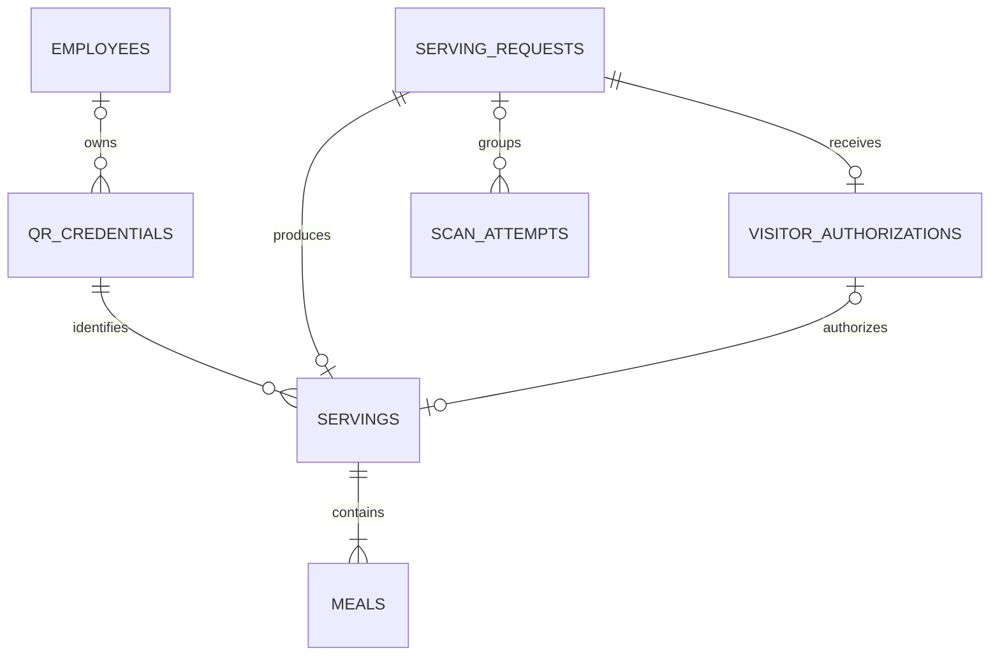

# Database layer

Migration `006_employee_email_approval.sql` adds atomic bulk-import request identity and immutable administrator email approvals. It preserves historical messages and holds existing queued messages as legacy pending approvals. Single registration creates DRAFT emails; bulk import creates PENDING_APPROVAL emails. Read [the email workflow](../docs/email-delivery-workflow.md) and approve the target before applying it.

Migration `007_admin_record_removal.sql` adds append-only employee archives and meal voids. Administrator removal requires a reason and actor attribution. Removed employees are hidden and cannot be reactivated; their QR is revoked. Voided employee and visitor meals are excluded from normal history and totals while serving, scan, and audit evidence remains intact. Apply this migration before deploying code that uses removal controls.

Migration `008_employee_contact_details.sql` adds optional company and phone columns for existing employee compatibility. New individual and bulk registrations require both values, and meal history reports employee contact details alongside visitor contact details. Apply this migration before deploying code that reads or writes employee contact details.

Migration `009_master_qr_meal_allowances.sql` stores each visitor group's contact details and meal allowance against its master QR. Each committed scan consumes one allowance inside the meal transaction, and the final allowance marks the QR exhausted.

`schema.sql` defines a fresh MySQL 8.4 schema in the database selected by the operator. It does not create, select, reset, or migrate a database. Applying it requires separate authorization. Do not apply it to an existing populated database. No existing data is deleted or transformed by the application on startup.

The schema uses InnoDB, `utf8mb4`, foreign keys with restrictive deletion, and UTC `DATETIME(6)` values. Every application database connection sets its session time zone to `+00:00`. External datetime inputs must include a UTC offset and are converted to UTC before storage.

## Relationships

| Tables | Purpose |
| --- | --- |
| `departments`, `employees` | Employee identity, required email, department, active status, and an external selfie reference. Employee codes are unique; employee count is unrestricted. |
| `staff_accounts`, `roles`, `staff_account_roles`, `staff_sessions` | Password hashes, role assignments, and expiring server-verified sessions. |
| `locations`, `scanner_devices`, `meal_types` | Serving locations, registered scanners, and configurable meal categories. |
| `qr_credentials` | Exactly two credential kinds: `EMPLOYEE` and `MASTER`. Tokens are random, hashes support lookup, and encrypted token copies support secure resending. |
| `email_queue` | Encrypted queued delivery payloads and delivery status. No email sender runs in this phase. |
| `serving_requests` | Immutable request identifiers, request fingerprints, and terminal serving outcomes. |
| `visitor_authorizations` | An authenticated administrator's approval for one exact master serving, including visitor details, quantity, waiter, and scanner. |
| `servings`, `meals` | A serving header and one dated row for each actual meal. Employee and direct master servings have quantity one. Direct master servings store company, visitor name, email, and phone; legacy authorized group servings retain their quantity and approval. |
| `scan_attempts` | Every received attempt, its final result, and rejection reason. Unknown scanner or credential references remain nullable so malformed attempts can still be recorded. |
| `audit_events` | Administrative changes with sanitized before/after values and the authenticated actor. |
| `system_locks` | A bootstrap lock used to serialize creation of the first administrator. |
| `scan_app_settings` | One backend-selected shared scanner identity, counter, meal type, and enable flag. The scan page has no configuration selectors. |
| `scan_app_requests` | Immutable ownership of each public scan UUID by a hashed browser identity and its captured server settings. It can precede any valid serving request, so malformed QR attempts need no invented serving row. |

## Database guarantees

- Only `EMPLOYEE` and `MASTER` are accepted as QR kinds. There are no individual visitor credentials or single-use credential rules.
- An employee has at most one unrevoked credential. An expired credential must be revoked before replacement.
- A serving's employee identity and credential kind must match its referenced QR.
- A request can produce at most one serving. Deliberate repeat meals use new request identifiers.
- A direct master serving has quantity one, all four required visitor fields, and no authorization identifier. A legacy master serving instead references its exact scoped approval and leaves the new fields null. Employee servings cannot contain visitor details. Each legacy approval can produce at most one serving.
- Meal unit numbers are unique within a serving and cannot exceed its quantity. Services create all promised units in the same transaction.
- QR identity, finalized requests, servings, meals, finalized scan outcomes, and audit history cannot be rewritten through ordinary updates. QR and approval revocations are permanent.
- Restrictive foreign keys preserve the relationships behind recorded history. The application account must not have schema-changing privileges capable of bypassing triggers or constraints.

## Transaction rules

The Python services validate either an authenticated staff session or the restricted server-only shared-scanner context, then check employee status, scanner and location, QR expiry and revocation, and visitor inputs before recording meals. Direct master meals do not require per-serving administrator approval. The public scanner uses a dedicated `Meal Scanner` account marked `is_scanner`, with no password or staff-session access. Its records identify the shared scanner instead of an individual human. Neither identity nor service settings come from submitted staff identifiers.

`ScanAppService` first commits a UUID/browser-hash mapping with the server-selected shared settings, then delegates to the existing meal service. Retries use the same captured settings. The independent signed browser cookie is never a staff credential. Result lookup checks browser ownership before it can delegate to the receipt service; the public API exposes no employee metadata or private photo endpoint. Admin reports continue to require human administrator authentication.

Every intended serving has one operation UUID. Camera rereads and network retries reuse it; an explicit new serving uses a fresh UUID. Reusing the same identifier with changed inputs is rejected. The scanner flow must preserve this identifier until the waiter intentionally starts another serving.

An exact successful retry returns the original `APPROVED` result, serving identifier, and individual meal identifiers, with `duplicate=true`. Its additional scan attempt is logged with `DUPLICATE_REQUEST` to distinguish the repeated read from a new meal. A fingerprint binds the request to the authenticated waiter, credential, scanner, location, meal type, and quantity. The initial accepted authorization proof is stored separately and must match on both successful and rejected retries. Incorrect proofs for a prepared visitor authorization reject only the attempt, allowing the assigned waiter to submit the correct proof. Historical rejected requests without stored proof metadata return `IDEMPOTENCY_PROOF_UNAVAILABLE` instead of claiming that an unverifiable replay matches.

Completed retries match the original scanner code and use the original receipt's scanner and location for verification. Moving a scanner later does not invalidate a completed result; the repeated attempt still records its current location. Pending visitor approvals retain their approved location and cannot be served after the scanner moves to a different location.

The receipt of an attempt is persisted before serving processing. The completed successful scan, serving, individual meals, and request result commit together. Approval is returned only after commit succeeds. Rejections update the durable receipt separately when meal processing rolls back. A receipt remaining `RECEIVED` after interruption requires reconciliation; it is not evidence of an approved meal.

`MealService.read` records an eligible master read as `AWAITING_DETAILS` and leaves the serving request pending without approving or recording a meal. The scanner then submits company, name, email, and phone under the same UUID. The first submitted visitor fields are normalized and bound by a separate immutable hash. Retried submissions must match those fields. The visitor snapshot, meal, request result, and successful scan commit together. Legacy authorizations keep their existing constraints and validation; a direct visitor meal never fabricates an authorizing administrator.

## Credentials and queued email

Raw QR tokens contain no names, employee codes, or other personal details. Only their hashes are used for lookup and scan history. The recoverable token and email payload are encrypted with application-managed keys outside the database configuration's database password. Secure resend decrypts the active employee token and queues a fresh encrypted payload without rotating the credential. Revocation cancels pending delivery and removes recoverable credential material.

Passwords are stored only as salted password hashes. Selfies remain in separate storage; MySQL holds their object reference. Never include password hashes, raw QR or session tokens, encryption keys, or encrypted delivery payloads in audit snapshots or logs.

## Reports

`ReportService.employee_history` requires `ADMIN` or `AUDITOR`, an employee identifier, and two timezone-aware datetimes. The interval includes `start` and excludes `end`. Results have one row per meal with UTC time, employee, meal type, waiter, scanner, and location. Pagination uses an ascending meal identifier, `after_id`, and a limit from 1 to 1,000.

`ReportService.meal_report` uses the same roles and interval. It returns exact meal and serving counts, employee and visitor meal totals, and breakdowns by credential kind, meal type, location, waiter, and authorizing administrator. All aggregates are obtained in one SQL statement so concurrent writes cannot make different subtotals observe different snapshots.

The department, employee, location, and staff names displayed in reports reflect their current records. Historical identifiers and serving locations remain attached to immutable servings. This phase does not snapshot every descriptive label.

## Verification boundaries

Unit tests use isolated substitutes and do not require a database server. Separate integration tests require an explicitly authorized MySQL 8.4 test server and schema creation permission. Schema application, concurrency behavior, and MySQL trigger enforcement cannot be established by unit tests alone. No production database connection, schema application, email delivery, or deployment is part of this phase.
